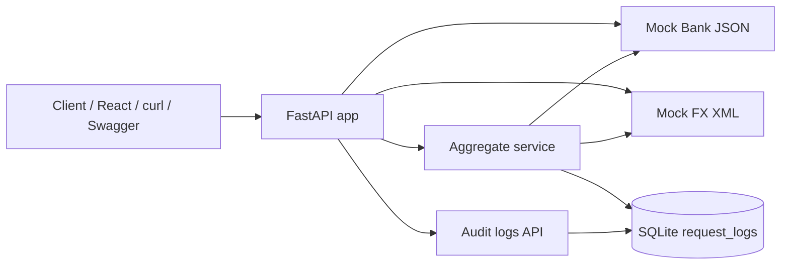

# Architecture

## Overview

The sandbox is a single FastAPI app that exposes mock upstream systems and an aggregation endpoint. Aggregation results (and failures) are persisted to SQLite for operational visibility.

## Component diagram

## Request flow: `GET /aggregate/{customer_id}`

1. Client calls `/aggregate/{customer_id}`.
2. Service looks up mock bank JSON for that customer.
3. Service parses mock FX XML into a rate map.
4. On success: return merged JSON (`accounts`, `fx_rates`, `meta.latency_ms`) and insert a `200` audit row.
5. On unknown customer: insert a `404` audit row, then return `404`.

## Request flow: `GET /audit-logs`

1. Client (dashboard, curl, or Swagger) calls `/audit-logs` with optional `limit`.
2. API reads `request_logs` ordered by newest `id` first.
3. Response is a JSON array of audit rows for operational visibility.

## Data formats

| Source | Format | Path |
|--------|--------|------|
| Bank accounts | JSON | `/mocks/bank/accounts/{customer_id}` |
| FX rates | XML | `/mocks/fx/rates` |
| Unified view | JSON | `/aggregate/{customer_id}` |
| Audit trail | JSON | `/audit-logs?limit=` |

## Audit log schema (`request_logs`)

| Column | Purpose |
|--------|---------|
| endpoint | Path called |
| customer_id | Customer key when applicable |
| status_code | HTTP outcome |
| latency_ms | Processing time |
| summary | Short result note |
| created_at | UTC timestamp |

## Design notes

- Mocks live in-process so the PoC runs with no external services or Docker.
- XML parsing is isolated in `parse_fx_xml()` so aggregation stays easy to test.
- Tests override the DB dependency with an in-memory SQLite database.
