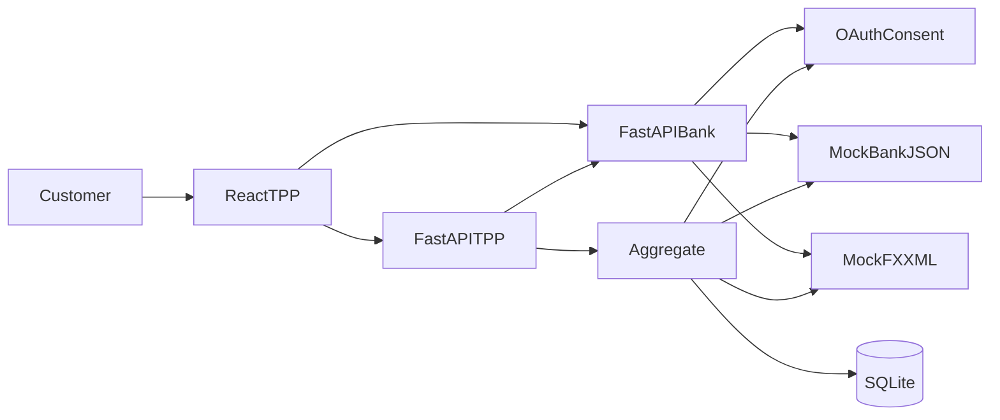

# Architecture

## Overview

The sandbox is a single FastAPI process that plays two roles:

- **ASPSP (bank):** mock ledger, OAuth2 authorization-code + consent, later Open API phases
- **TPP:** `/tpp/oauth/exchange` and `/aggregate/{customer_id}` so the React dashboard never holds the client secret

Aggregation requires a Bearer JWT **bound to an active consent**. Results (and 403/404 failures) are persisted to SQLite. Audit log listing remains public for the PoC dashboard.

This PoC uses HS256 JWTs. It does **not** implement FAPI, mTLS, PAR, or JARM.

## Actors

| Actor | Who in this PoC | Responsibility |
|-------|-----------------|----------------|
| Customer | `demo` / `demo` on the bank page; `C001` / `C002` | Grants and revokes consent |
| ASPSP (bank) | `/oauth/*`, `/open-api/v1/*`, `/mocks/*` | Accounts, products, payments, consent |
| TPP | React dashboard + `/tpp/oauth/exchange` + `/aggregate` | Uses bank APIs only after consent |
| Ops | Companion [it-ops-monitor](https://github.com/turjoy18/it-ops-monitor) | Probes `/health` and Phase 1 products |

Same process, two API roles — not three deployables.

## Data handling

- **Purpose limitation:** FX is used only to produce an HKD reporting total, not stored as a customer profile.
- **Minimization:** audit `summary` masks account-like ids and decimal amounts. Access tokens are never logged.
- **Retention:** SQLite `sandbox.db` is a local PoC file. There is no scheduled purge; delete the file to wipe consents, payments, and audits. A production bank would set a retention period and anonymize.
- **Screen scraping:** the TPP must call APIs with a consent-bound token; there is no HTML scrape path for accounts.

## Component diagram

## OAuth authorization-code flow

1. TPP dashboard redirects the browser to `GET /oauth/authorize` with `client_id=sandbox-tpp`, registered `redirect_uri`, `scope`, and `state`.
2. Customer signs in on the **bank-hosted** page (`demo` / `demo`), picks `C001` or `C002`, and approves scopes.
3. Bank stores an **active consent** and a one-time **authorization code**, then redirects to `http://127.0.0.1:5173/callback?code=&state=`.
4. Dashboard posts `{code, state}` to `POST /tpp/oauth/exchange`.
5. TPP (server) calls `POST /oauth/token` with the client secret and receives an access token.
6. Access JWT claims: `sub` (customer id), `client_id`, `consent_id`, `scope` (space-delimited).

Scopes: `accounts.read`, `transactions.read`, `payments.initiate`.

`POST /auth/login` still issues a JWT for demos but is **deprecated** for TPP access (no consent). Aggregate requires consent.

## Request flow: `GET /aggregate/{customer_id}`

1. Client sends Bearer JWT + customer id.
2. `get_current_principal` verifies the JWT (HS256). Missing/invalid tokens return `401`.
3. Active consent must cover this customer and include `accounts.read`; otherwise `403`.
4. Token `sub` must equal the path customer id (C001 cannot read C002).
5. Service loads accounts via the bank service and FX rates (`ok` / `stale` / `unavailable`).
6. On success: return accounts, FX map, `meta.hkd_total`, and insert a `200` audit row (`tpp_id`, `consent_id`, `purpose=account_aggregation`). FX outage still returns accounts.

## Consent revoke

- `GET /consents` — consents for the token customer
- `DELETE /consents/{id}` — customer revokes
- `POST /oauth/revoke` — `{consent_id}` or `{token}`
- After revoke, aggregate returns `403`

## Audit log schema (`request_logs`)

| Column | Purpose |
|--------|---------|
| endpoint | Path called |
| customer_id | Customer key when applicable |
| status_code | HTTP outcome |
| latency_ms | Processing time |
| summary | Masked result note (no tokens, no raw balances) |
| tpp_id | Confidential client id (`sandbox-tpp`) |
| consent_id | Consent the call was made under |
| purpose | e.g. `account_aggregation` |
| created_at | UTC timestamp |

## Data formats

| Source | Format | Path | Auth |
|--------|--------|------|------|
| Bank accounts | JSON | `/mocks/bank/accounts/{customer_id}` | Public |
| FX rates | XML | `/mocks/fx/rates` | Public |
| Authorize | HTML | `/oauth/authorize` | Bank customer login |
| Token | JSON | `/oauth/token` | Client id + secret |
| TPP exchange | JSON | `/tpp/oauth/exchange` | Public (code + state) |
| Unified view | JSON | `/aggregate/{customer_id}` | Bearer + consent |
| Open API products | JSON | `/open-api/v1/products` | Public |
| Audit trail | JSON | `/audit-logs?limit=` | Public |

## Design notes

- Mocks live in-process so the PoC runs with no external services or Docker.
- XML parsing is isolated in `parse_fx_xml()` so aggregation stays easy to test.
- The TPP client secret is env-only (`OAUTH_CLIENT_SECRET`); the SPA never sees it.
- Tests override the DB dependency with in-memory SQLite and obtain tokens via authorize + `/tpp/oauth/exchange`.
