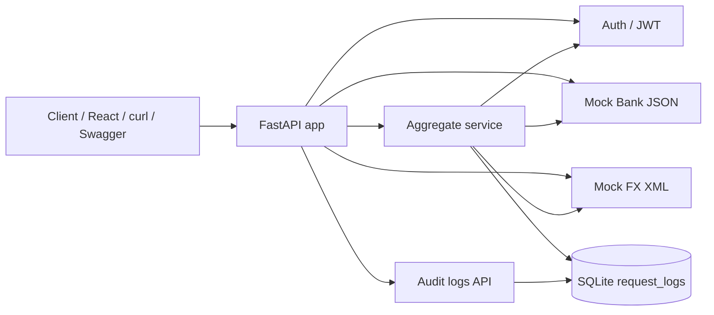

# Architecture

## Overview

The sandbox is a single FastAPI app that exposes mock upstream systems and an aggregation endpoint. Aggregation requires a JWT from the mock login endpoint. Aggregation results (and failures) are persisted to SQLite for operational visibility. Audit log listing remains public for the PoC dashboard.

## Component diagram

## Auth flow

1. Client posts `{"username":"demo","password":"demo"}` to `POST /auth/login`.
2. Server validates demo credentials and returns `{ "access_token": "...", "token_type": "bearer" }`.
3. Client calls `GET /aggregate/{customer_id}` with `Authorization: Bearer <token>`.
4. `get_current_user` verifies the JWT (HS256) using `JWT_SECRET_KEY` (or the local default).
5. Invalid / missing tokens return `401` before aggregation runs.

Public (no token): `/health`, mocks, `/auth/login`, `/audit-logs`.

## Request flow: `GET /aggregate/{customer_id}`

1. Client sends Bearer JWT + customer id.
2. Auth dependency validates the token.
3. Service looks up mock bank JSON for that customer.
4. Service parses mock FX XML into a rate map.
5. On success: return merged JSON (`accounts`, `fx_rates`, `meta.latency_ms`) and insert a `200` audit row.
6. On unknown customer: insert a `404` audit row, then return `404`.

## Request flow: `GET /audit-logs`

1. Client (dashboard, curl, or Swagger) calls `/audit-logs` with optional `limit`.
2. API reads `request_logs` ordered by newest `id` first.
3. Response is a JSON array of audit rows for operational visibility.

## Data formats

| Source | Format | Path | Auth |
|--------|--------|------|------|
| Bank accounts | JSON | `/mocks/bank/accounts/{customer_id}` | Public |
| FX rates | XML | `/mocks/fx/rates` | Public |
| Login | JSON | `/auth/login` | Public |
| Unified view | JSON | `/aggregate/{customer_id}` | Bearer JWT |
| Audit trail | JSON | `/audit-logs?limit=` | Public |

## Audit log schema (`request_logs`)

| Column | Purpose |
|--------|---------|
| endpoint | Path called |
| customer_id | Customer key when applicable |
| status_code | HTTP outcome |
| latency_ms | Processing time |
| summary | Short result note |
| created_at | UTC timestamp |

## Design notes

- Mocks live in-process so the PoC runs with no external services or Docker.
- XML parsing is isolated in `parse_fx_xml()` so aggregation stays easy to test.
- JWT auth is demo-grade (hardcoded user, HS256 secret); not a production IdP.
- Tests override the DB dependency with an in-memory SQLite database and obtain tokens via `/auth/login`.
